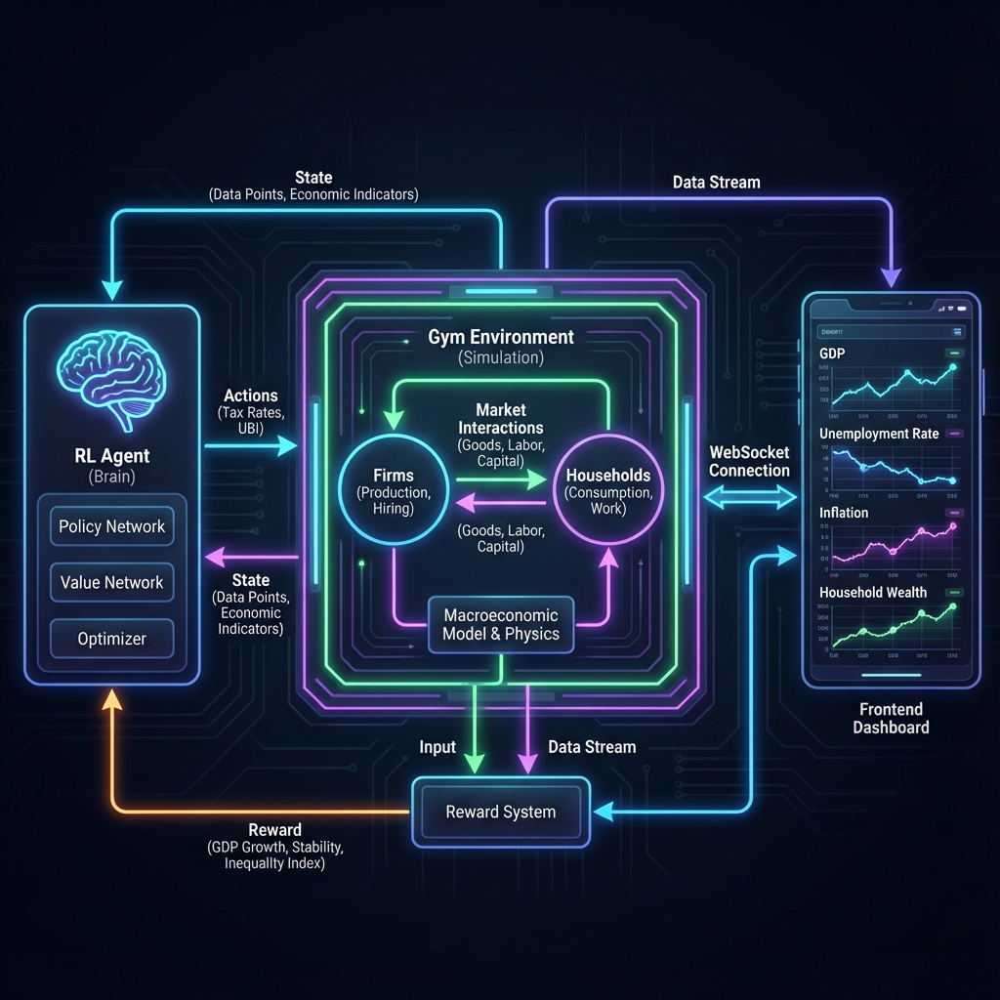

# System Architecture & Workflow

This diagram illustrates the high-level architecture of the Economy Reinforcement Simulator, showing the interaction between the Reinforcement Learning (RL) Agent and the Economic Environment.

## Workflow Description

1.  **RL Agent (The Brain)**:
    *   **Input**: Receives the current `State` (Observation) from the environment. This includes Macro indicators (GDP, Inflation) and Micro aggregates (Avg Wage, Unemployment).
    *   **Processing**: The PPO (Proximal Policy Optimization) model processes this state to determine the best course of action.
    *   **Output**: Emits an `Action` vector (Income Tax Rate, Corporate Tax Rate, UBI Level).

2.  **Economy Environment (The Simulation)**:
    *   **Step 1: Policy Application**: The Agent's tax/UBI rates are applied to the government logic.
    *   **Step 2: Market Interactions**:
        *   **Firms**: Produce goods, hire workers (Labor Market), set prices/wages.
        *   **Households**: Work (Labor Supply), consume goods (Goods Market), pay taxes.
    *   **Step 3: Physics & Rules**: The simulation enforces constraints like "Diminishing Returns," "Contract Durations," and "Bankruptcy Rules."

3.  **Reward System**:
    *   Calculates a score based on the health of the economy (e.g., +1 for GDP Growth, -1 for High Inflation/Unemployment).
    *   This `Reward` is sent back to the Agent to reinforce good behavior.

4.  **Frontend Dashboard**:
    *   Connects via WebSocket to the Simulation.
    *   Visualizes the real-time state of the economy (KPIs, Charts, Tables) for human monitoring.
